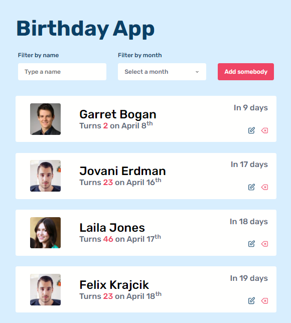

# Term 3 JS Project : Birthday App

This was our final project about vanilla JS which is a birthday list.

As a class, we were given a list of people to render in the app. The app sorts the list according to the people's closest birthday.

There is a file in the project called person.json which contains a list of people, and we want to add all those people to the birthday list app.

The first time the app is launched, it fetches all the data from the people.json local file.

Once the data is loaded in the app, it is saved on localstorage, and there is no need to work with the json file anymore.

## Demo of the result

The users will be able to add a new element on the list (only on the app list localstorage, not on the json). Here are the fields :

-   first name
-   last name
-   birthday
-   an url for their avatar image
-   an id for handling the operations on the objects. (no need to add that on the form)

The users are able to edit an element on the list. When user clicks the edit button, a modal appears with a form inside, to edit any attribute.

The users can delete an element. There will be a modal that will ask if user is sure to delete the element.

Every action is persisted into the local storage.

A package for handling date computations. Added as a dependency of this project.

[https://date-fns.org/v1.29.0/docs/differenceInYears](https://date-fns.org/v1.29.0/docs/differenceInYears)

## Used tech stack

- [HTML5](http://html5doctor.com/)
- [CSS](https://developer.mozilla.org/en-US/docs/Web/CSS)
- [Vanilla Javascript](http://vanilla-js.com/)
